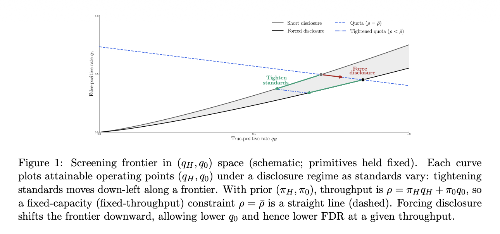
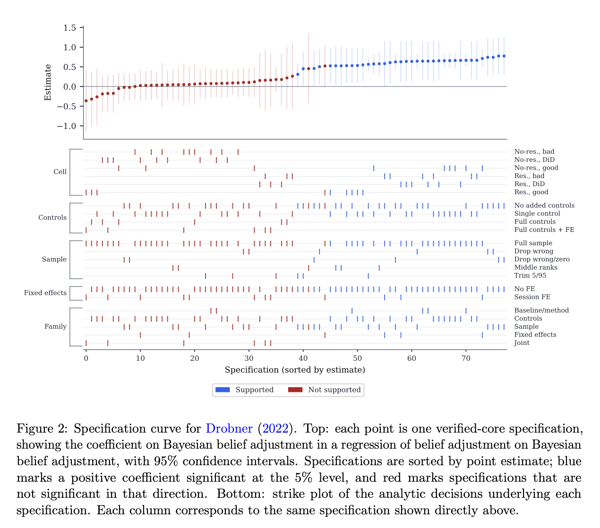
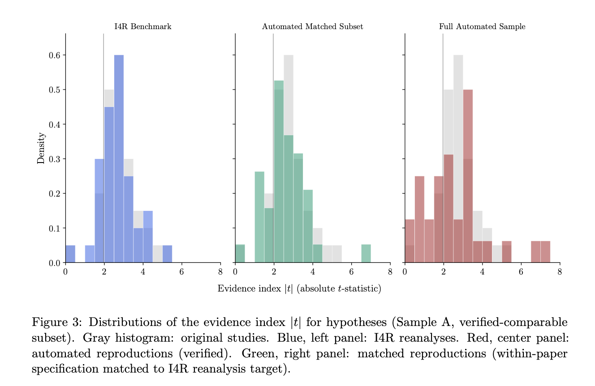
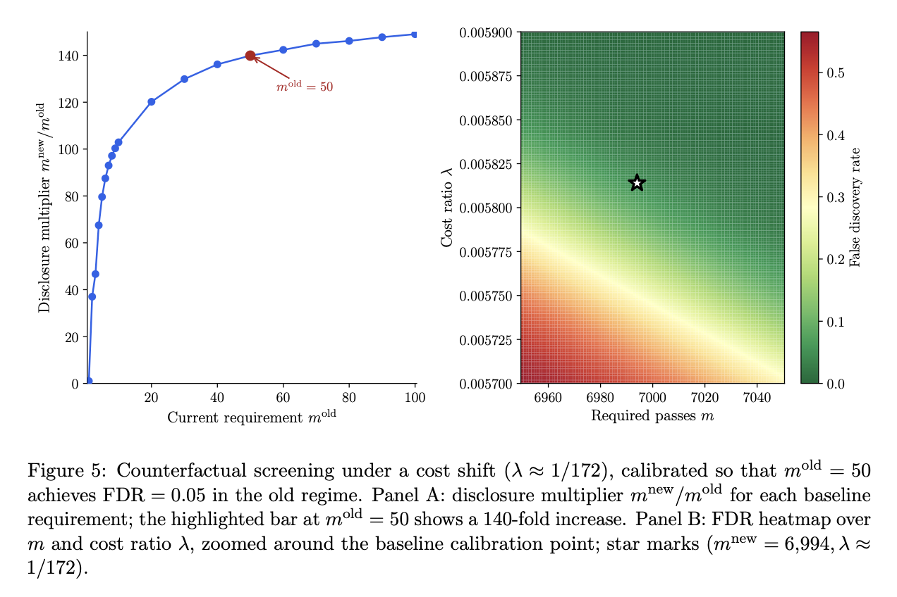

##### Download

+ [Paper](/papers/cheap_science/gsekeres_cheap_science.pdf)
+ [GitHub Repo](https://github.com/gsekeres/agentic-specification-search)


---

##### Abstract

A journal screens submissions when authors can privately generate many correlated pieces of evidence and selectively disclose favorable realizations. We study a commitment game in which the journal chooses an acceptance rule, a researcher sequentially searches over evidence at marginal cost $\gamma$, and the journal observes only the report the researcher chooses to disclose. The induced operating point is a pair $(q_H,q_0)$, where $q_H$ is the probability of accepting a high-impact project and $q_0$ is the probability of accepting a non-high project (in practice, these can be read as a true effect and a false positive). We characterize the attainable screening frontier as testing becomes cheap -- the ability of the journal to distinguish between high-quality and low-quality projects.

The results separate two editorial instruments that are often conflated. Tightening standards makes researchers search harder. Requiring disclosure makes the resulting search informative to the editor. First, we prove a mechanism-independent information bound: the Bernoulli Kullback-Leibler divergence between acceptance under high and non-high projects is bounded by the likelihood-ratio information the researcher can generate before optimal stopping. This is the journal's goal -- to attain exponential screening of the submitted projects. Second, we show that capacity-scale search is necessary for exponential purification, but not sufficient. If equilibrium reports contain only $o(1/\gamma)$ disclosed results, false positives cannot fall at the dependence-adjusted exponential rate without collapsing recall. Third, we show that simple robustness-check rules requiring $m(\gamma)=\Theta(1/\gamma)$ disclosed passes in a journal-defined region achieve exponential screening while maintaining nonvanishing recall, and are rate-optimal when information and dependence scales are comparable.

We then construct auditable specification surfaces for $103$ empirical economics papers published in AEA journals. The empirical section validates the cheap-testing premise and estimates the type, dependence, and cost primitives that determine counterfactual disclosure requirements. The counterfactual requirements are sobering: to maintain conventional purity at fixed throughput, the journal would need to require disclosure of about $7{,}000$ significant robustness checks. This raises a serious issue for observational work going forward, and we argue for the need to develop methods to interpret sets of many specifications simultaneously, as opposed to current interpretative practice, which focuses on a handful of main specifications and a small set of robustness checks.

---
##### Figure 1: The Editorial Screening Frontier



##### Figure 2: Specification Curve for a Specific Paper



##### Figure 4: Validation Against the Institute for Replication



##### Figure 5: Counterfactual Robustness Requirements



---

##### Citation

Fishman, Nic and Gabriel Sekeres. 2026. "Editorial Screening when Science is Cheap." *Working Paper*.

```BibTeX
@article{fishmanSekeres2026,
author = {Nic Fishman and Gabriel Sekeres},
year = {2026},
title ={Editorial Screening when Science is Cheap},
journal = {Working Paper},
url = {https://gabesekeres.com/papers/cheap_science/gsekeres_cheap_science.pdf}
}
```

---