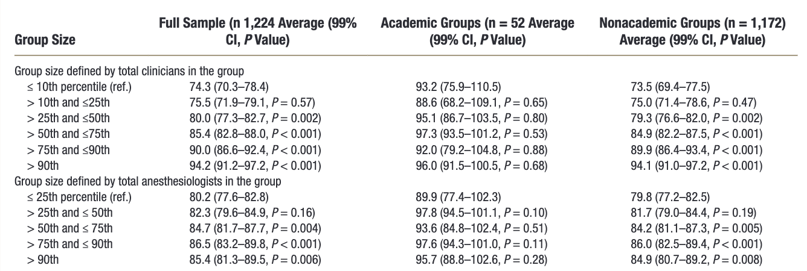

---

##### Download

+ [Paper](gsekeres_mips_paper.pdf)

---

##### Abstract

The Merit-Based Incentive Payment System was introduced in 2017 by the Centers for Medicare & Medicaid Services, the primary U.S. public insurer. MIPS ties payments to a score determined by four categories: cost, improvement activities, promoting interoperability, and quality. Scores for each category are aggregated across all physicians in a group, who all then receive the same score. Using publicly available data from the Centers for Medicare & Medicaid Services, we find that larger group size is associated with higher MIPS scores. This result is not dependent on academic affiliaton, and is robust to a variety of specifications.

---

##### Figure 1: Anesthesia Group Size and MIPS Scores


##### Table 1: Association between Group Size and Merit-Based Incentive Payment System Scores



---

##### Citation

Sekeres G, Miller T, Mariano E, Glance L, Sun E. 2024. "Association between Anesthesia Group Size and Merit-Based Incentive Payment System Scores." *Anesthesiology* 140 (4): 853–855. doi: https://doi.org/10.1097/ALN.0000000000004887

```BibTeX
@article{SMMGS24,
author = {Gabriel Sekeres and Thomas R. Miller and Edward R. Mariano and Laurent G. Glance and Eric C Sun},
year = {2024},
title ={Association between Anesthesia Group Size and Merit-Based Incentive Payment System Scores},
journal = {Anesthesiology},
volume = {140},
number = {4},
pages = {853--855},
url = {https://doi.org/10.1097/ALN.0000000000004887}
}
```

---