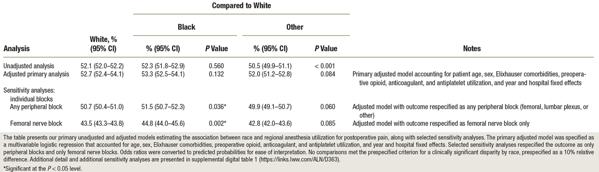
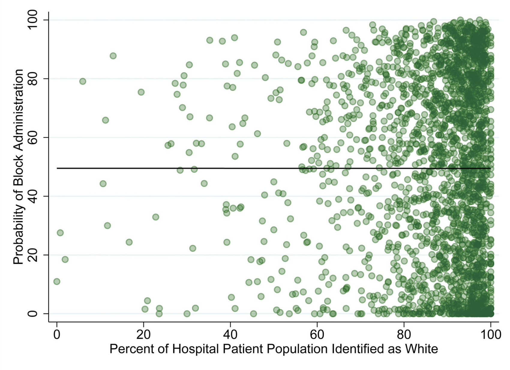

---

##### Download

+ [Paper](gsekeres_tka_paper.pdf)

---

##### Abstract

<strong>Background:</strong> Regional anesthesia for total knee arthroplasty has been deemed high priority by national and international societies, and its use can serve as a measure of healthcare equity. The association between utilization of regional anesthesia for postoperative pain and (1) race and (2) hospital in patients undergoing total knee arthroplasty was estimated. The hypothesis was that Black patients would be less likely than White patients to receive regional anesthesia, and that variability in regional anesthesia would more likely be attributable to the hospital where surgery occurred than race.

<strong>Methods:</strong> This study used Medicare fee-for-service claims for patients aged 65 yr or older who underwent primary total knee arthroplasty between January 1, 2011, and December 31, 2016. The primary outcome was administration of regional anesthesia for postoperative pain, defined as any peripheral (femoral, lumbar plexus, or other) or neuraxial (spinal or epidural) block. The primary exposure was self-reported race (Black, White, or Other). Clinical significance was defined as a relative difference of 10% in regional anesthesia administration.

<strong>Results:</strong> Data from 733,406 cases across 2,507 hospitals were analyzed: 90.7% of patients were identified as White, 4.7% as Black, and 4.6% as Other. Median hospital-level prevalence of use of regional anesthesia was 51% (interquartile range, 18 to 79%). Black patients did not have a statistically different probability of receiving a regional anesthetic compared to White patients (adjusted estimates: Black, 53.3% [95% CI, 52.5 to 54.1%]; White, 52.7% [95% CI, 52.4 to 54.1%]; P = 0.132). Findings were robust to alternate specifications of the exposure and outcome. Analysis of variance revealed that 42.0% of the variation in block administration was attributable to hospital, compared to less than 0.01% to race, after adjusting for other patient-level confounders.

<strong>Conclusions:</strong> Race was not associated with administration of regional anesthesia in Medicare patients undergoing primary total knee arthroplasty. Variation in the use of regional anesthesia was primarily associated with the hospital where surgery occurred.

---

##### Table 2: Primary Unadjusted, Adjusted, and Selected Sensitivity Analyses Estimating Probability of Regional Anesthesia Utilization



##### Figure 1: Unadjusted hospital-level probability of use of regional anesthesia for total knee arthroplasty, by percentage of patient population identified as White


---

##### Citation

Dixit, A. A., Sekeres, G., Mariano, E. R., Memtsoudis, S. M., & Sun, E. C. (2024). Association of patient race and hospital with utilization of regional anesthesia for treatment of postoperative pain in total knee arthroplasty: A retrospective analysis using Medicare claims. *Anesthesiology*, 130(2), 220-230. doi: [10.1097/ALN.0000000000004827](https://doi.org/10.1097/ALN.0000000000004827)

```BibTeX
@article{DSMMS24,
author = {Anjali A Dixit and Gabriel Sekeres and Edward R Mariano and Stavros M Memtsoudis and Eric C Sun},
year = {2024},
title ={Association of patient race and hospital with utilization of regional anesthesia for treatment of postoperative pain in total knee arthroplasty: A retrospective analysis using Medicare claims},
journal = {Anesthesiology},
volume = {130},
number = {2},
pages = {220--230},
url = {https://doi.org/10.1097/ALN.0000000000004827}}
```

---

##### Related material

+ [Supplementary Figure 1](https://cdn-links.lww.com/permalink/aln/d/aln_2023_10_30_dixit_aln-d-23-00187_sdc1.pdf)
+ [Supplementary Table 1](https://cdn-links.lww.com/permalink/aln/d/aln_2023_10_30_dixit_aln-d-23-00187_sdc2.pdf)
+ [Supplementary Table 2](https://cdn-links.lww.com/permalink/aln/d/aln_2023_10_30_dixit_aln-d-23-00187_sdc3.pdf)
