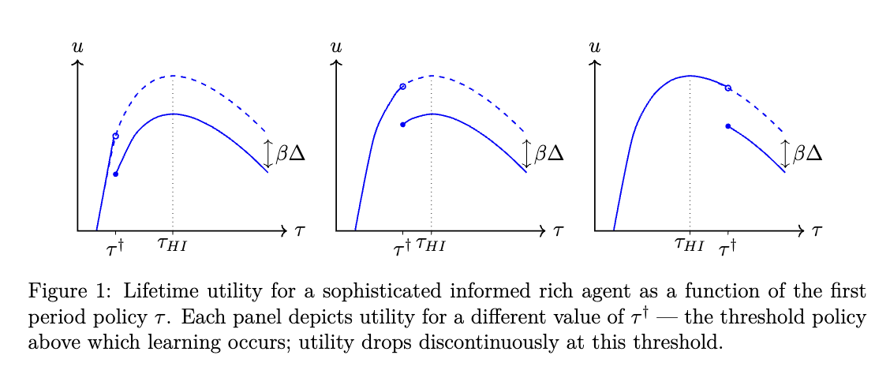
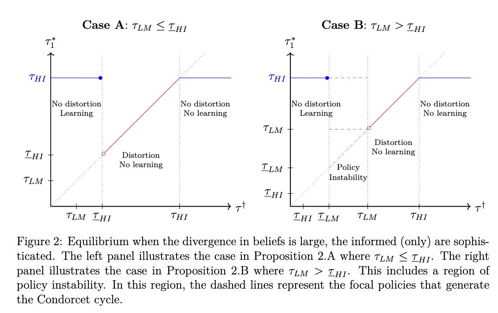
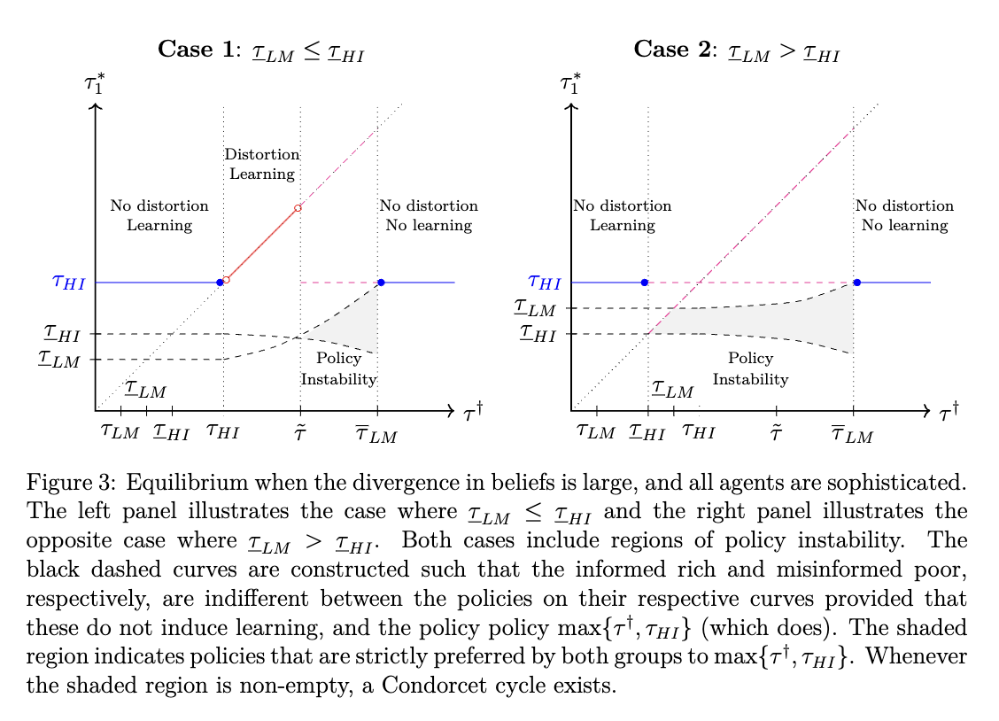

##### Download

+ [Paper](/papers/slippery_slope/gsekeres_slippery_slope.pdf)
+ [Appendix](/papers/slippery_slope/gsekeres_slippery_slope_appendix.pdf)


---

##### Abstract

Slippery slope arguments — the idea that otherwise beneficial reforms should be rejected lest they beget further undesirable one — are ubiquitous in political discourse. We provide a learning-based policy-feedback mechanism to explain why slippery slope dynamics arise. Additionally, we provide conditions under which, in equilibrium, sophisticated agents will successfully manipulate policy to either induce or prevent a slippery slope dynamic.

---
##### Figure 1: Violations of Single-Peakedness



##### Figure 2: Standard Policy Dynamics



##### Figure 3: Policy Dynamics with Instabilities



---

##### Citation

Parameswaran, Giri, Gabriel Sekeres, and Haya Goldblatt. 2025. "The Politics of the Slippery Slope." *Journal of Politics* 87(2): 709-723. doi: [10.1086/732965](https://doi.org/10.1086/732965)

```BibTeX
@article{parameswaran2025slippery_slope,
author = {Giri Parameswaran and Gabriel Sekeres and Haya Goldblatt},
year = {2025},
title ={The Politics of the Slippery Slope},
journal = {Journal of Politics},
volume = {87},
number = {2},
pages = {709-723},
url = {https://doi.org/10.1086/732965}
}
```

---
